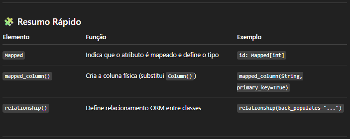
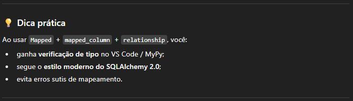
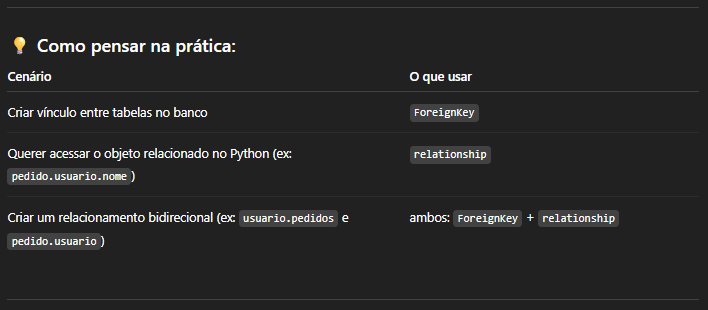
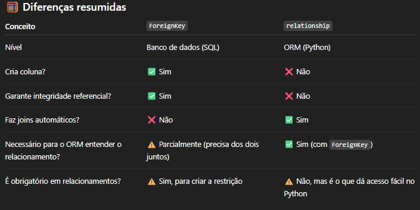
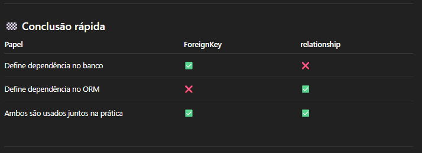
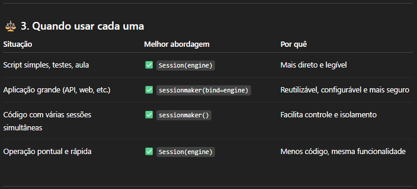
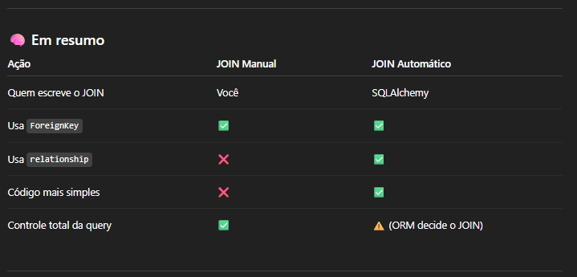
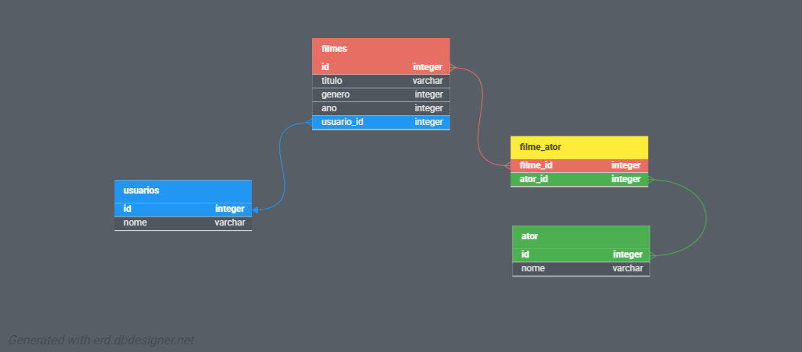
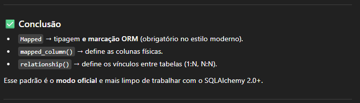

# Declaração de tipo ou CAMPO MAPEADO

- Em __SQLAlchemy__, o termo __CAMPO MAPEADO__ se refere a um atributo de uma classe que é mapeado para uma coluna em uma tabela do banco de dados.
    - Exp: id: __int__ = Column(Integer, primary_key=True, autoincrement=True)

- Quando o objeto da classe possui __relacionamento__ em um __CAMPO MAPEADO__ é necessário indicar explicitamente que o campo é mapeado com __Mapped__, para garantir que o tipo do atributo. Essa anotação ajuda o SQLAlchemy a entender objetos relacionados na classe.
v
---
<br>

# O SQLAlchemy possui duas versões SQLAlchemy 1 e SQLAlchemy 2, que difere na tipagem e na sintaxe.

### SQLAlchemy 1 ou SQLAlchemy 2 (sem tipagem):

- Esse é o estilo “clássico” declarativo, em ambas as versões.

- Não há tipagem explícita (Python não sabe que id é int, por exemplo), mas o ORM entende normalmente.

```
from sqlalchemy import Column, Integer, String
from sqlalchemy.ext.declarative import declarative_base

Base = declarative_base()

class Usuario(Base):
    __tablename__ = "usuarios"

    id = Column(Integer, primary_key=True)
    nome = Column(String, nullable=False)
    idade = Column(Integer)
    cpf = Column(Integer, unique=True, nullable=False)
```
### SQLAlchemy 1 (com tipagem Python)

- Sintaticamente correto e equivalente funcionalmente ao anterior.
    - A diferença é apenas estética e de ajuda do editor (IDE), o SQLAlchemy 1 ignora as anotações dos demais tipos.

- Essa tipagem não interfere no ORM (ele ainda usa apenas o Column()), mas pode ajudar ferramentas de análise estática como mypy, Pylance etc.

```
from sqlalchemy import Column, Integer, String
from sqlalchemy.ext.declarative import declarative_base

Base = declarative_base()

class Usuario(Base):
    __tablename__ = "usuarios"

    id: int = Column(Integer, primary_key=True)
    nome: str = Column(String, nullable=False)
    idade: int = Column(Integer)
    cpf: int = Column(Integer, unique=True, nullable=False)
```

### SQLAlchemy 2 (com tipagem Python):

- **Recomendado** a partir do SQLAlchemy 2
    - Ele faz uso de:
        - Mapped[] → vincula explicitamente a tipagem Python com o tipo de coluna do ORM;
        - mapped_column() → substitui Column();


```
from sqlalchemy.orm import Mapped, mapped_column
from typing import Optional

class Usuario(Base):
    __tablename__ = "usuarios"

    id: Mapped[int] = mapped_column(primary_key=True)
    nome: Mapped[str] = mapped_column(nullable=False)
    idade: Mapped[Optional[int]] = mapped_column(default=None)
    cpf: Mapped[int] = mapped_column(unique=True, nullable=False)
```

---
---
<br>

# Quando Mapped é obrigatório?

### SQLAlchemy 2 (relationships):

- **relationship()** define relacionamentos entre tabelas, isto é, entre classes ORM.

- Exemplo de 1:N (um para muitos):
    - Usuario.postagens é uma lista de postagens.
    - Postagem.autor é um objeto Usuario.
    - back_populates faz o link bidirecional


```
from typing import List
from sqlalchemy.orm import relationship, Mapped, mapped_column, DeclarativeBase

class Base(DeclarativeBase):
    pass

class Usuario(Base):
    __tablename__ = "usuarios"

    id: Mapped[int] = mapped_column(primary_key=True)
    nome: Mapped[str] = mapped_column(nullable=False)

    # Um usuário pode ter vários postagens
    postagens: Mapped[List["Postagem"]] = relationship(back_populates="autor")

class Postagem(Base):
    __tablename__ = "postagens"

    id: Mapped[int] = mapped_column(primary_key=True)
    titulo: Mapped[str] = mapped_column(nullable=False)
    usuario_id: Mapped[int] = mapped_column(ForeignKey("usuarios.id"))

    # Vínculo reverso
    autor: Mapped["Usuario"] = relationship(back_populates="postagens")
```





---
<br >

# Entender a diferença de ForeignKey e relationship

### ForeignKey → Define a ligação no banco de dados

O ForeignKey serve para criar a restrição de chave estrangeira (no nível do banco de dados).
Ele diz ao banco que uma coluna depende de uma outra tabela.


````
from sqlalchemy import Column, Integer, String, ForeignKey
from sqlalchemy.orm import declarative_base

Base = declarative_base()

class Usuario(Base):
    __tablename__ = "usuarios"

    id: int = Column(Integer, primary_key=True)
    nome: str = Column(String, nullable=False)

class Pedido(Base):
    __tablename__ = "pedidos"

    id: int = Column(Integer, primary_key=True)
    usuario_id: int = Column(Integer, ForeignKey("usuarios.id"))

````

- O que acontece aqui:
    - pedidos.usuario_id aponta para usuarios.id 
    - o banco de dados vai garantir integridade referencial
    - não é possível inserir um pedido com usuario_id inexistente em usuarios

- Em resumo:
    - ForeignKey = vínculo no banco de dados (nível SQL).
---

### relationship → Define a ligação no Python (ORM)

- O relationship() serve somente no lado Python (ORM).
    - Ele cria um vínculo lógico entre as classes, permitindo acessar dados relacionados como atributos.

````
from typing import List
from sqlalchemy.orm import Mapped, mapped_column, relationship
from sqlalchemy import Integer, String, ForeignKey

Base = declarative_base()

class Usuario(Base):
    __tablename__ = "usuarios"

    id: Mapped[int] = mapped_column(Integer, primary_key=True)
    nome: Mapped[str] = mapped_column(String, nullable=False)

    pedidos: Mapped[List["Pedido"]] = relationship(
        "Pedido", back_populates="usuario"
    )


class Pedido(Base):
    __tablename__ = "pedidos"

    id: Mapped[int] = mapped_column(Integer, primary_key=True)
    usuario_id: Mapped[int] = mapped_column(ForeignKey("usuarios.id"))
    usuario: Mapped["Usuario"] = relationship(
        "Usuario", back_populates="pedidos"
    )
````

- O que acontece aqui:
    - **relationship** não cria colunas no banco; ele cria um vínculo lógico de relacionados entre tabelas,sem escrever o JOIN manualmente.

### Em resumo:
- relationship = vínculo no ORM (Python), não no banco.








### Uso pratico de relationship JOIN automático e manual:

````
from sqlalchemy import Column, Integer, String
from sqlalchemy import ForeignKey, create_engine, select
from sqlalchemy.orm import declarative_base, relationship, Session

# ======================
# CONEXÃO AO BANCO
# ======================
engine = create_engine("sqlite:///:memory:")

# ======================
# BANCO E SESSÃO
# ======================
session = Session(engine)

# ======================
# MODELAGEM DO BANCO
# ======================
BaseModel = declarative_base()

class Usuario(BaseModel):
    __tablename__ = "usuarios"

    id = Column(Integer, primary_key=True)
    nome = Column(String, nullable=False)

    # Relacionamento 1:N (um usuário tem vários pedidos)
    pedidos = relationship("Pedido", back_populates="usuario")

class Pedido(BaseModel):
    __tablename__ = "pedidos"

    id = Column(Integer, primary_key=True)
    descricao = Column(String)
    usuario_id = Column(ForeignKey("usuarios.id"))

    # Lado oposto do relacionamento
    usuario = relationship("Usuario", back_populates="pedidos")

# ======================
# CRIANDO AS TABELAS
# ======================
BaseModel.metadata.create_all(engine)

# ======================
# INSERÇÃO DE DADOS
# ======================
u1 = Usuario(nome="Alice")
p1 = Pedido(descricao="Pedido A", usuario=u1)
p2 = Pedido(descricao="Pedido B", usuario=u1)

session.add_all([u1, p1, p2])
session.commit()

# ======================
# CONSULTA JOIN AUTOMÁTICA
# ======================
# Agora não precisamos mais informar a condição do join:
consulta_automatica = select(Usuario.nome, Pedido.descricao).join(Usuario.pedidos)

result = session.execute(consulta_automatica).all()
print(result)  # [('Alice', 'Pedido A'), ('Alice', 'Pedido B')]

# ======================
# CONSULTA JOIN MANUAL (explícita)
# ======================
consulta_manual = (select(Usuario.nome, Pedido.descricao).join(Pedido, Pedido.usuario_id == Usuario.id))

result = session.execute(consulta_manual).all()
print(result)  # [('Alice', 'Pedido A'), ('Alice', 'Pedido B')]

session.close()
````

Dica de Criação de uma Sessão:

Conclusão

🔹 Se você está estudando ou fazendo scripts pequenos:
→ Use Session(engine) — simples, claro e suficiente.

🔹 Se você está construindo uma aplicação maior (como uma API FastAPI ou Flask):
→ Use sessionmaker — mais organizado e escalável.



### Conclusão:

- relationship não cria JOINs no banco, mas quando você acessa um atributo relacionado (usuario.pedidos ou pedido.usuario), o SQLAlchemy gera automaticamente uma query com JOINs ou SELECTs para carregar esses dados.



---
---
<br>

# Exemplo de Mapped em relacionamentos (1:N e N:N)

````
from typing import List
from sqlalchemy import Column, String, Integer, ForeignKey, Table
from sqlalchemy import create_engine, select
from sqlalchemy.orm import DeclarativeBase, Session, sessionmaker, relationship
from sqlalchemy.orm import Mapped, mapped_column

from pathlib import Path

# Caminho da pasta para arquivo SQLite
caminho= Path(__file__).parent
# Nome da tabela
nome_tabela = "cinema.sqlite"

# ======================
# ENDEREÇO DE CONEXÃO 
# ====================== 
# Criar o banco de dados e a tabela
DATABASE_URL = f"sqlite:///{caminho / nome_tabela}"  # Usando SQLite como exemplo
engine = create_engine(DATABASE_URL)

# ======================
# BANCO E SESSÃO
# ======================
Session = sessionmaker(bind=engine)

# Base principal do ORM moderno
class Base(DeclarativeBase):
    pass

# ==========================
# TABELA FILME_ATOR N:N (Tabela de Associação)
# ==========================
# O nome da tabela deve corresponder ao usado no relacionamento (filmes_ator)
# Usando 'Column' do SQLAlchemy para definir as colunas de uma tabela de associação simples.
filmes_ator = Table(
    "filmes_ator",
    Base.metadata,
    Column("filme_id", ForeignKey("filmes.id"), primary_key=True),
    Column("ator_id", ForeignKey("atores.id"), primary_key=True),
)

# ==========================
# MODELO USUÁRIO (1:N)
# ==========================
class Usuario(Base):
    __tablename__ = "usuarios"

    id: Mapped[int] = mapped_column(primary_key=True)
    nome: Mapped[str] = mapped_column(String(80), nullable=False)

    # Um usuário pode ter vários filmes (1:N)
    filmes: Mapped[List["Filme"]] = relationship(back_populates="usuario") # Removido o argumento "Filme", pois é o padrão

    def __repr__(self) -> str:
        return f"<Usuario(nome={self.nome!r})>"


# ==========================
# MODELO FILME (1:N e N:N)
# ==========================
class Filme(Base):
    __tablename__ = "filmes"

    id: Mapped[int] = mapped_column(primary_key=True)
    titulo: Mapped[str] = mapped_column(String(120), nullable=False)
    genero: Mapped[str] = mapped_column(String(50))
    ano: Mapped[int] = mapped_column(Integer)

    # Relacionamento 1:N → com Usuario (Chave Estrangeira)
    usuario_id: Mapped[int] = mapped_column(ForeignKey("usuarios.id"))
    usuario: Mapped[Usuario] = relationship(back_populates="filmes")

    # Relacionamento N:N → com Ator (CORRIGIDO)
    # Usa a tabela 'filmes_ator' como 'secondary'
    atores: Mapped[List["Ator"]] = relationship(
        secondary=filmes_ator,  # Passa a variável Table definida acima
        back_populates="filmes"
    )

    def __repr__(self) -> str:
        return f"<Filme(titulo={self.titulo!r}, ano={self.ano})>"


# ==========================
# MODELO ATOR (N:N)
# ==========================
class Ator(Base):
    __tablename__ = "atores"

    id: Mapped[int] = mapped_column(primary_key=True)
    nome: Mapped[str] = mapped_column(String(80), nullable=False)

    # Relacionamento N:N → com Filmes
    filmes: Mapped[List["Filme"]] = relationship(
        secondary=filmes_ator,  # Usa a mesma variável Table
        back_populates="atores"
    )

    def __repr__(self) -> str:
        return f"<Ator(nome={self.nome!r})>"
    
# ======================
# CRIANDO AS TABELAS
# ======================
Base.metadata.create_all(engine)


with Session() as session:
    usuario = Usuario(nome="Décio")

    filme1 = Filme(titulo="Gladiador", genero="Ação", ano=2000, usuario=usuario)
    filme2 = Filme(titulo="Titanic", genero="Romance", ano=1997, usuario=usuario)

    ator1 = Ator(nome="Russell Crowe")
    ator2 = Ator(nome="Leonardo DiCaprio")

    filme1.atores.append(ator1)
    filme2.atores.append(ator2)

    session.add_all([usuario, filme1, filme2, ator1, ator2])
    session.commit()

    # Exibe filmes e seus atores
    for filme in session.query(Filme).all():
        print(filme, "→ Atores:", filme.atores)
    
````



### Relacionamentos em detalhes
- 1:N → Usuario → Filme
    - Usuario.filmes → lista de filmes pertencentes ao usuário
    - Filme.usuario → referência ao dono do filme

````
usuario = Usuario(nome="Décio")
filme = Filme(titulo="Gladiador", genero="Ação", ano=2000, usuario=usuario)
````

- N:N → Filme ↔ Ator
    - Filme.atores → lista de atores do filme
    - Ator.filmes → lista de filmes em que o ator participa

````
ator1 = Ator(nome="Russell Crowe")
ator2 = Ator(nome="Joaquin Phoenix")

filme.atores.extend([ator1, ator2])
````

